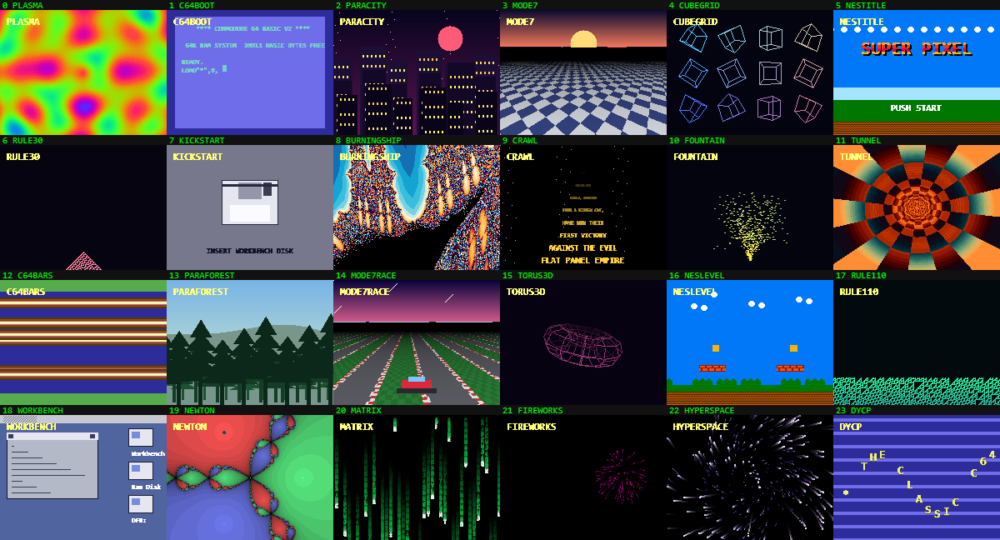
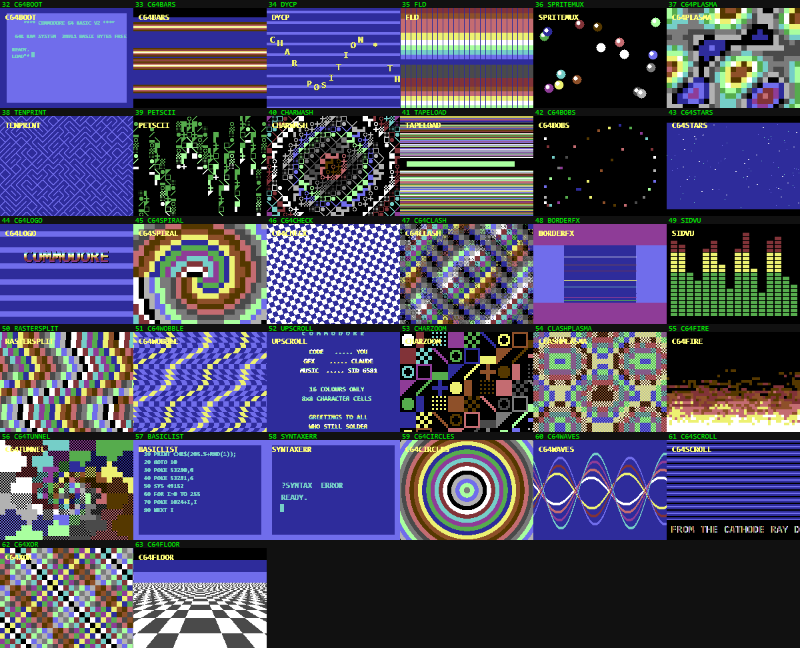
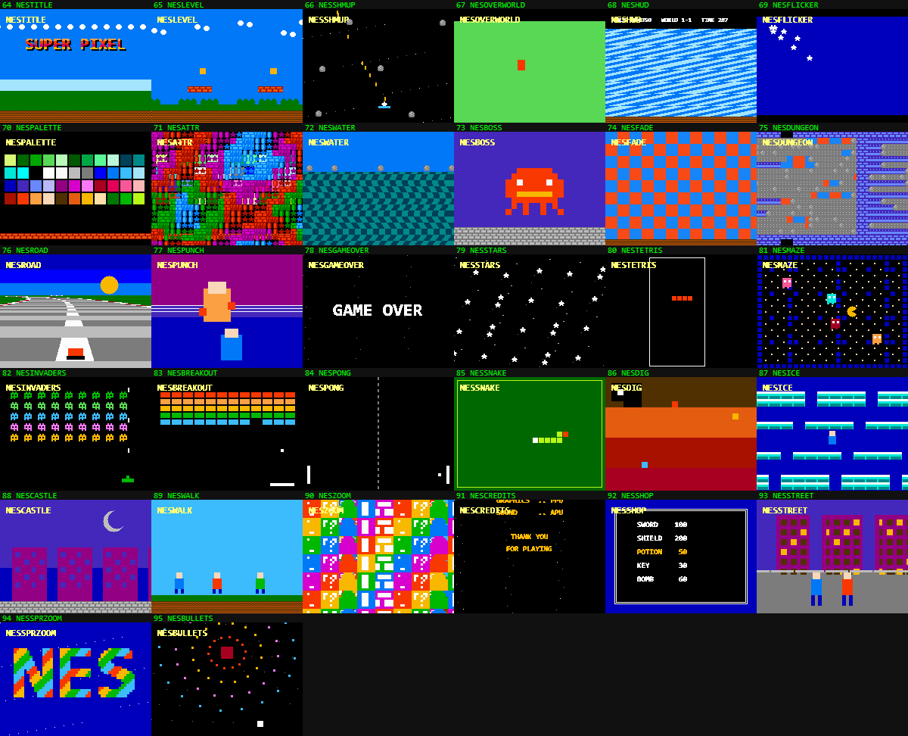
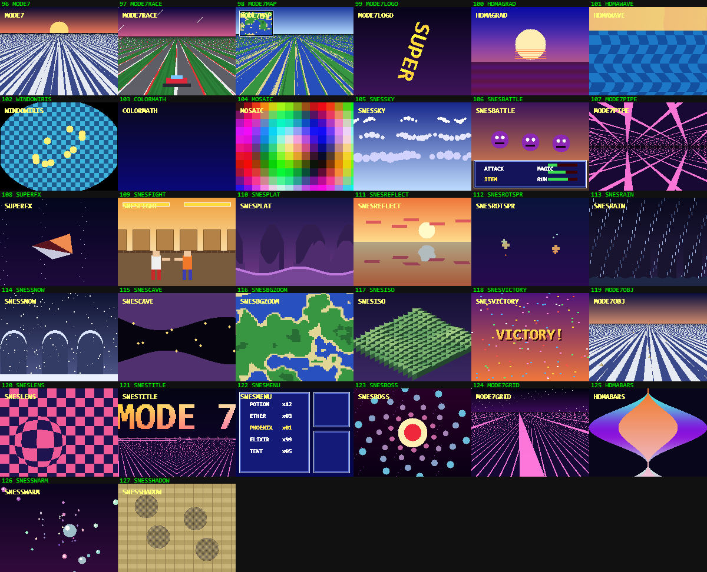
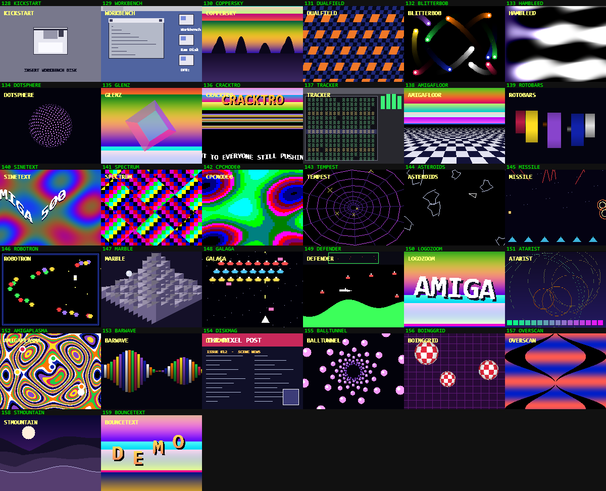
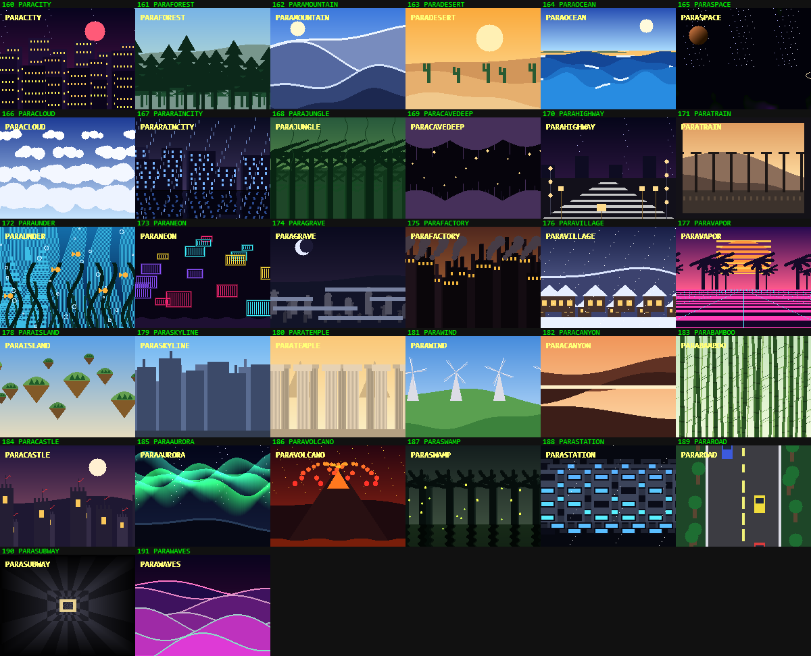
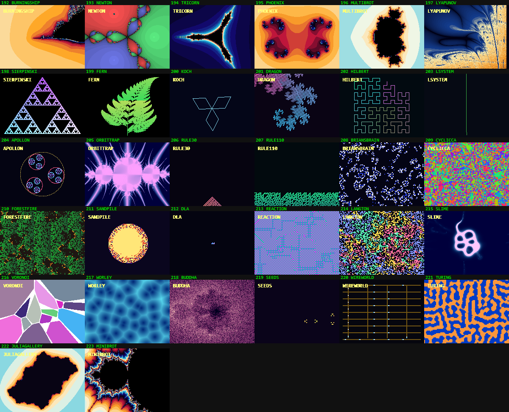
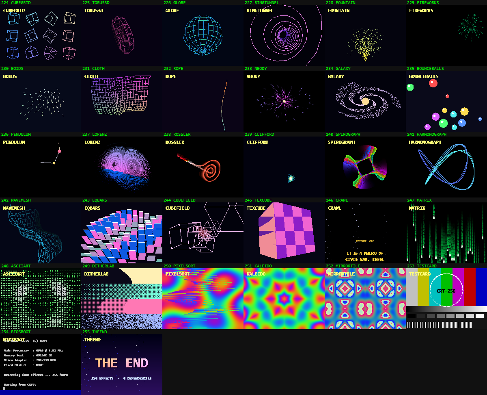

# CRT-256

**256 demoscene effects in one HTML file.** No dependencies, no build step, no network. Software-rendered pixel by pixel into a 200×150 buffer and blitted at an integer scale with `image-rendering: pixelated`, so it looks correct fullscreened on a CRT at 400×300.



## Run it

Open `index.html` in a browser. That's it — it works over `file://`, so you can drag it onto a machine with no toolchain and fullscreen it.

| Key | |
|---|---|
| `space` / `←` `→` | next / previous effect |
| `R` | random effect |
| `P` | hold on the current effect (stop auto-advance) |
| `N` | toggle the effect-name flash |
| `F` | fullscreen |
| `1`–`9` | jump to one of the first nine |

Effects run 15s each with a Bayer-dither dissolve between them. A full cycle is about 64 minutes.

## What's in it

Every effect is written from scratch against a `Uint32Array` framebuffer — no canvas drawing APIs beyond `putImageData`, no WebGL, no libraries. Expensive effects (raymarching, fractals, cellular automata) render at 100×75 into 2×2 blocks to hold 60fps.

The running order interleaves families round-robin, so consecutive effects never come from the same one.

**Core (32)** — plasma, textured tunnel, Doom fire, metaballs, raymarched SDFs, Mandelbrot, ripple water, Wolf3D raycaster, video feedback, VHS glitch, oscilloscope, strange attractors, synthwave grid.

**Commodore 64 (32)** — real Pepto palette. DYCP scroller, FLD line-stretch, Kefrens bars, raster bars, sprite multiplexer, colour clash, `10 PRINT` maze, PETSCII rain, tape-loader stripes, BASIC listing, boot screen.

<details><summary>C64 contact sheet</summary>


</details>

**NES (32)** — 8×8 tile and attribute rendering off the NES palette. Auto-scrolling platform level, overworld, status-bar split scroll, sprite-flicker limit, boss, plus attract modes for Tetris, Pac-Man, Invaders, Breakout, Pong, Snake, Dig Dug, Ice Climber, Castlevania, Punch-Out.

<details><summary>NES contact sheet</summary>


</details>

**SNES (32)** — a proper focal-length **Mode 7**: checkerboard floor, F-Zero track, Mario Kart map with live minimap, spinning logo plane, object field. Plus HDMA gradients and per-scanline waves, colour-math translucency, mosaic transition, window iris, SuperFX flat-shaded ship, RPG battle screen.

<details><summary>SNES contact sheet</summary>


</details>

**Amiga / ST / arcade (32)** — Kickstart insert-disk, Workbench, copper gradients, blitter bobs, glenz vectors, cracktro layout, ProTracker UI, HAM bleed, ZX Spectrum colour clash, CPC mode 0, and Tempest, Asteroids, Missile Command, Robotron, Defender, Galaga, Marble Madness.

<details><summary>Amiga contact sheet</summary>


</details>

**Parallax (32)** — 2 to 7 independently scrolling layers each: cyberpunk city, forest, mountains, desert, ocean, deep space, rain-city with reflection, jungle, cave, night highway, train window, underwater, neon, graveyard, factory, snowy village, vaporwave sunset, floating islands, temple, windmills, canyon, bamboo, castle, aurora, volcano, swamp, space station, subway.

<details><summary>Parallax contact sheet</summary>


</details>

**Fractals & cellular automata (32)** — Burning Ship, Newton basins, Tricorn, Phoenix, Multibrot, Lyapunov, Buddhabrot, orbit traps, chaos game, Barnsley fern, Koch, dragon curve, Hilbert, L-system, Apollonian gasket; Rule 30/110, Brian's Brain, cyclic CA, forest fire, sandpile, DLA, Gray-Scott reaction-diffusion, Turing patterns, Langton's ant, Wireworld, physarum slime mould, Voronoi.

<details><summary>Fractal contact sheet</summary>


</details>

**3D, particles & screen effects (32)** — wireframe and solid 3D, cloth, verlet ropes, boids, n-body, galaxy, double pendulum, Lorenz, Rössler, Clifford, spirograph, harmonograph, Star Wars crawl, Matrix rain, ASCII renderer, dither lab, pixel sort, kaleidoscope, test card, BIOS boot.

<details><summary>3D / misc contact sheet</summary>


</details>

## Adding an effect

```js
scenes.push({
  name: 'NAME',            // unique; shown in the corner flash
  tag: 'c64',              // family — drives the interleaved running order
  reset(){ ... },          // optional, called when the scene comes around
  draw(T, t, dt){ ... }    // T = target buffer, t = seconds, dt = frame delta
});
```

`draw` must write every pixel it cares about — `T` alternates between two buffers and arrives holding another scene's frame. Anything needing frame-to-frame persistence keeps its own accumulation buffer and `T.set(acc)`s at the end.

See [CLAUDE.md](CLAUDE.md) for the full architecture notes, helper reference, and the verification harnesses.

## License

MIT.
